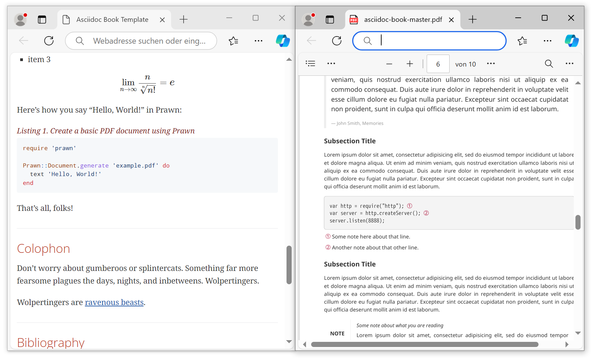
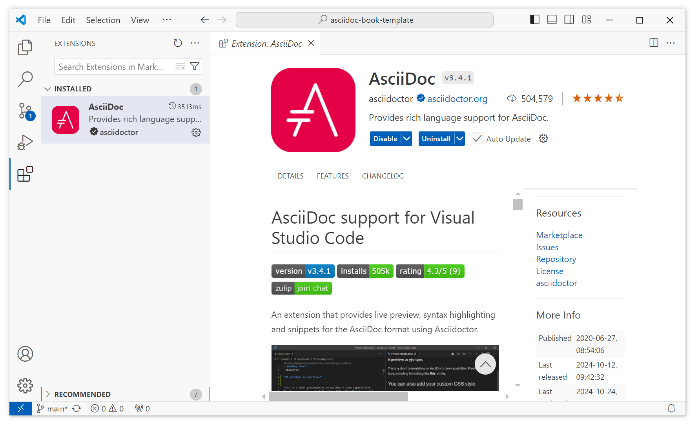

# asciidoc-book-template


[AsciiDoc](https://docs.asciidoctor.org/asciidoc/latest/) is a lightweight and semantic markup language primarily designed for writing technical documentation. The language can be used to produce a variety of presentation-rich output formats, all from content encoded in a concise, human-readable, plain text format.

This project aims to provide a simple book template that highlights the benefits of using AsciiDoc for writing technical documentation from a single source. It focuses on the automation of output generation and is also intended to specifically appeal to users of the Microsoft Wondows operating system without relying on using Docker containers. 

## Basic installation for different output formats

Install Ruby first, for example, by using the [RubyInstaller](https://rubyinstaller.org/downloads/). Confirm successful installation:

```bash
ruby --version
```

Install [Asciidoctor](https://docs.asciidoctor.org/asciidoctor/latest/):

```bash
gem install asciidoctor
asciidoctor --version
```

Install [Asciidoctor-PDF](https://docs.asciidoctor.org/pdf-converter/latest/):

```bash
gem install asciidoctor-pdf
asciidoctor-pdf -v
```

Install [syntax highlighting](https://docs.asciidoctor.org/pdf-converter/latest/syntax-highlighting/) for code examples in Asciidoctor-PDF:

```bash
gem install rouge
```

**Please note:** For HTML output, there is a [built-in adapter](https://docs.asciidoctor.org/asciidoctor/latest/syntax-highlighting/) for client-side syntax highlighting with the widely-used [highlight.js](https://highlightjs.org/) library. No need to install anything for HTML output.


Install [Asciidoctor EPUB3](https://docs.asciidoctor.org/epub3-converter/latest/#install-the-published-gem):

```bash
gem install asciidoctor-epub3
asciidoctor-epub3 -v
```


<!--


Install rendering for [STEM](https://docs.asciidoctor.org/pdf-converter/latest/stem/) expressions:

```bash
gem install asciidoctor-mathematical
```

**Please note:** When converting to HTML, Asciidoctor relies on the JavaScript-based MathJax library to parse and render the STEM expressions in the browser when the page is loaded. Asciidoctor PDF does not provide native support for STEM blocks and inline macros (i.e., asciimath and latexmath). Therefore, we use ...


```
gem install asciidoctor-texnical
```

-->

## Test basic installation

Create the project folder ``asciidoc-book-template/example`` or clone this repository.

Move to folder ``asciidoc-book-template/example`` and create file ``basic-example.adoc``:

```asciidoc
= Document Title
Document Writer <doc@example.com>
// Prevent spurious changes every time you convert the document
:reproducible:
// Allow caption attributes for listings and source blocks
:listing-caption: Listing
// Uncomment next line and comment out the line after next to explore syntax highlighting
// :source-highlighter: highlight.js 
:source-highlighter: rouge
// Enable autogenerated table of contents
:toc:
// Enable STEM expression processing
:stem: latexmath
// Uncomment next line to add a title page (or set doctype to book)
//:title-page:
// Uncomment next line to set page size (default is A4)
//:pdf-page-size: Letter

An example of a basic https://asciidoc.org[AsciiDoc] document prepared by {author}.

== Introduction

A paragraph followed by an unordered list{empty}footnote:[AsciiDoc supports unordered, ordered, and description lists.] with square bullets.footnote:[You may choose from square, disc, and circle for the bullet style.]

[square]
* item 1
* item 2
* item 3

== Main

Here's how you say "`Hello, World!`" in Prawn:

.Create a basic PDF document using Prawn
[source,ruby]
----
require 'prawn'

Prawn::Document.generate 'example.pdf' do
  text 'Hello, World!'
end
----

Here is a STEM expression:

[stem]
++++
\lim_{n \to \infty}\frac{n}{\sqrt[n]{n!}} = {\large e}
++++

== Conclusion

That's all, folks!
```

**See also:** [AsciiDoc Syntax Quick Reference](https://docs.asciidoctor.org/asciidoc/latest/syntax-quick-reference/)

In the folder ``asciidoc-book-template/example``, execute the following commands to generate diferent output formats:

```bash
asciidoctor basic-example.adoc  
asciidoctor-pdf basic-example.adoc  
asciidoctor-epub3 basic-example.adoc  
```

Inspect output files.

## Create book template

Copy template files in folder ``asciidoc-book-template/src/`` from this repository to your ``asciidoc-book-template/src/`` folder or write your documentation, for example:

```
src/
├─ about.adoc 
├─ appendix.adoc 
├─ asciidoc-book-master.adoc 
├─ bibliography.adoc 
├─ chapter01.adoc 
├─ chapter02.adoc 
├─ colophon.adoc 
├─ introduction.adoc 
├─ preface.adoc
```

**See also:** [AsciiDoc Syntax Quick Reference](https://docs.asciidoctor.org/asciidoc/latest/syntax-quick-reference/)

## Generate book in different formats

Move to folder ``asciidoc-book-template/`` and generate output files in folder ``asciidoc-book-template/out``:

```bash
asciidoctor       src\asciidoc-book-master.adoc -o out\asciidoc-book-master.html
asciidoctor-pdf   src\asciidoc-book-master.adoc -o out\asciidoc-book-master.pdf
asciidoctor-epub3 src\asciidoc-book-master.adoc -o out\asciidoc-book-master.epub
```

Inspect output files:



**Please note:** The Microsoft Windows operating system uses ``\`` instead of ``/`` to specify file paths on the command line. On other systems, adjust the file paths in the command line arguments accordingly.

If you do not need sophisticated layout options and support for STEM/mathematical expressions in your PDF output, you are done here!

**Also see:** CLI commands in ``build.bat``.

## About STEM expressions and  PDF layout

When converting to HTML, Asciidoctor relies on the JavaScript-based [MathJax](https://www.mathjax.org/) library to parse and render [STEM expressions](https://docs.asciidoctor.org/pdf-converter/latest/stem/) in the browser when the page is loaded. Asciidoctor PDF does not provide native support for STEM blocks and inline macros (e.g. *latexmath*). 

The standard STEM processor for AsciiDoc is [Asciidoctor Mathematical](https://github.com/asciidoctor/asciidoctor-mathematical). However, it is difficult to install because it requires specific third-party libraries and system fonts for image rendering. You can consider using the [Docker (OCI) image for Asciidoctor](https://github.com/asciidoctor/docker-asciidoctor), which includes [Asciidoctor Mathematical](https://github.com/asciidoctor/asciidoctor-mathematical).

Alternatively, you can 

- Print the HTML output to PDF, for example using the *[Microsoft Print to PDF](https://answers.microsoft.com/en-us/windows/forum/all/how-to-add-or-reinstall-the-microsoft-pdf-printer/a473357b-8a8f-44fe-ba3a-9680b6bdfa79)* printer.
- Use [Asciidoctor Web PDF](https://github.com/ggrossetie/asciidoctor-web-pdf) if you need custom and advanced layout options.

## [Asciidoctor Web PDF](https://github.com/ggrossetie/asciidoctor-web-pdf)

[Asciidoctor Web PDF](https://github.com/ggrossetie/asciidoctor-web-pdf) is an AsciiDoc to PDF converter based on web technologies with advances layout options:

- Complex layouts with CSS and JavaScript
- SVG icons with Font Awesome 5
- PDF document outline (i.e., bookmarks)
- Table Of Contents
- Document metadata (title, authors, subject, keywords, etc)
- Fully customizable template
- Syntax highlighting with [highlight.js](https://highlightjs.org/)
- Page numbering
- Preview mode
- STEM support with [MathJax 3](https://www.mathjax.org/)
- Templates for documents, letters, books, cheat sheets, resumes and slides

**Direct download:** https://github.com/ggrossetie/asciidoctor-web-pdf/releases (pre-compiled binaries, available under the *Assets* section)



Download the pre-compiled binaries for your system, create the folder ``asciidoc-book-template/.asciidoctor-web-pdf/`` and unzip the binaries there. 

Generate output files in folder ``asciidoc-book-template/out``:

```bash
.asciidoctor-web-pdf\asciidoctor-web-pdf.exe src\asciidoc-book-master.adoc -o out\asciidoc-book-master-WEB.pdf
```

To use a custom [CSS](https://de.wikipedia.org/wiki/Cascading_Style_Sheets) stylesheet, create the folder ``asciidoc-book-template/css/`` and put your stylesheet there. Generate output files with the flag ``-a stylesheet="+..\css\myStyle.css"``. The ``+`` prefix applies your custom stylesheet in addition to all the default styles:

```cmd
.asciidoctor-web-pdf\asciidoctor-web-pdf.exe src\asciidoc-book-master.adoc -a stylesheet="+..\css\myStyle.css" -o out\asciidoc-book-master-WEB.pdf
```

Inspect output files. Congrats!

## Other IDEs and text editors

- [Asciidoc FX](https://www.asciidocfx.com/) is a document editor to build PDF, Epub, Mobi and HTML books, documents and slides. It provides extensions for [PlantUML](https://sourceforge.net/projects/plantuml/), [Mermaid](https://mermaid.js.org/), and [MathJax](https://www.mathjax.org/).

- The [AsciiDoc extension](https://marketplace.visualstudio.com/items?itemName=asciidoctor.asciidoctor-vscode) for [Visual Studio Code](https://code.visualstudio.com/) provides live preview, syntax highlighting and snippets for the AsciiDoc format using Asciidoctor.

Any of these options can turn out to be your one-stop shop when it comes to editing AsciiDoc documents as easily as possible. However, when you find that you rely on a specfic IDE or tool configuration such as Visual Studio Code with the AsciiDoc extension, you might want to [make it portable](https://code.visualstudio.com/docs/editor/portable) and put it in your backup.

**Direct download:** https://code.visualstudio.com/download


<!--

**Please note:** To render STEM expressions for PDF output, use the flag ``-r asciidoctor-mathematical``:

```bash
asciidoctor-pdf -r asciidoctor-mathematical src/asciidoc-book-master.adoc -o out/asciidoc-book-master.pdf
```
It [fails to built](https://github.com/asciidoctor/asciidoctor-mathematical/issues/121) on the Microsoft Windows operating system


## Optional extensions

Install automatic hyphenation, if needed:
```
gem install text-hyphen
```

-->

