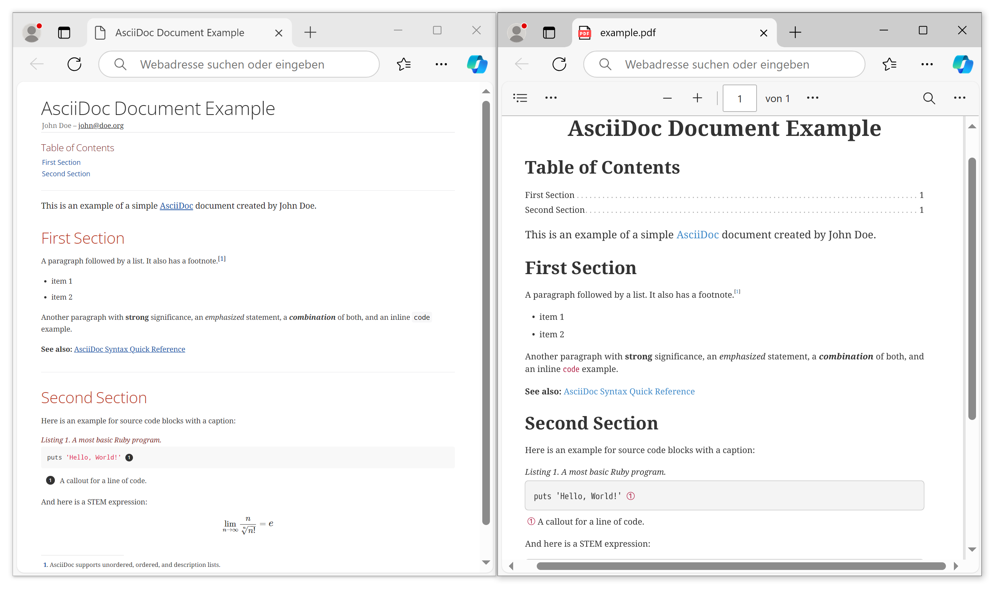

# asciidoc-book-template


[AsciiDoc](https://docs.asciidoctor.org/asciidoc/latest/) is a lightweight and semantic markup language primarily designed for writing technical documentation. The language can be used to produce a variety of presentation-rich output formats, all from content encoded in a concise, human-readable, plain text format.

This project is **an experiment** to create professional documents. It aims to provide simple templates that highlight the benefits of using the [AsciiDoc](https://docs.asciidoctor.org/asciidoc/latest/) standard for writing technical documentation with different output formats from a single source. It focuses on the automation of output generation and is intended to specifically appeal to users of the Microsoft Windows operating system without relying on using Docker containers. 

## Requirements

1. **Robust tooling** that is portable and can be saved/archived independently.

2. **Convenient text editing** with minimal text markup, support for math and program code.

3. **Various output formats** such as HTML web pages, EPUB e-books, and PDF documents.

4. **Automated output generation** using batch scripts.

## Bill of Materials

**Device:**
- Processor: Intel(R) Core(TM) i7-1065G7 CPU @ 1.30GHz 1.50 GHz
- RAM: 16,0 GB (15,6 GB verwendbar)
- System Type: 64-Bit-Betriebssystem, x64-basierter Prozessor
- Pen and Touch Input: Supported

**Operating System:**
- Edition: Windows 10 Enterprise
- Version: 22H2
- Installed: 01.10.2020
- OS Build: 19045.4651
- Performance: Windows Feature Experience Pack 1000.19060.1000.0

**Software:**
- Infrastructure
  - [RubyInstaller](https://rubyinstaller.org/downloads/): Version ``ruby 3.3.5 (2024-09-03 revision ef084cc8f4) [x64-mingw-ucrt]``
- Publishing platform:
  - [Asciidoctor](https://docs.asciidoctor.org/asciidoctor/latest/) reference implementation for HTML output: Version ``2.0.23``
  - [Asciidoctor-PDF](https://docs.asciidoctor.org/pdf-converter/latest/) for simple PDF generation: Version ``2.3.19``
  - [Asciidoctor EPUB3](https://docs.asciidoctor.org/epub3-converter/latest/#install-the-published-gem) for e-Book generation: Version `2.1.3`
  - [Rouge](https://rouge.jneen.net/) syntax highlighting: Version ``4.4.0``
- Personal development environment:
  - [Visual Studio Code](https://code.visualstudio.com/) IDE: Version ``VSCode-win32-x64-1.94.2``
  - [AsciiDoc extension](https://marketplace.visualstudio.com/items?itemName=asciidoctor.asciidoctor-vscode) for Visual Studio Code: Version ``3.4.1`` 

## Set-up

### Install the Publishing Platform

Install Ruby first, for example, by using the [RubyInstaller](https://rubyinstaller.org/downloads/). Confirm successful installation:

```bash
ruby --version
```

Install [Asciidoctor](https://docs.asciidoctor.org/asciidoctor/latest/):

```bash
gem install asciidoctor
asciidoctor --version
```

Install [Asciidoctor-PDF](https://docs.asciidoctor.org/pdf-converter/latest/):

```bash
gem install asciidoctor-pdf
asciidoctor-pdf -v
```

Install [syntax highlighting](https://docs.asciidoctor.org/pdf-converter/latest/syntax-highlighting/) for code examples in Asciidoctor-PDF:

```bash
gem install rouge
```

**Please note:** For HTML output, there is a [built-in adapter](https://docs.asciidoctor.org/asciidoctor/latest/syntax-highlighting/) for client-side syntax highlighting with the widely-used [highlight.js](https://highlightjs.org/) library. No need to install anything for HTML output.

Install [Asciidoctor EPUB3](https://docs.asciidoctor.org/epub3-converter/latest/#install-the-published-gem):

```bash
gem install asciidoctor-epub3
asciidoctor-epub3 -v
```

### Configure and Test the Publishing Platform

Create a projct folder, for example ``asciidoc-book-template/``. 

In your project folder, create a folder ``example/``. Your project file structure now should look similar to this:

```
asciidoc-book-template/
├─ example/
```

Move to the folder ``example/`` and create a file named ``example.adoc``:

```asciidoc
= AsciiDoc Document Example
John Doe <john@doe.org> 
// Allow caption attributes for listings and source blocks
:listing-caption: Listing
// Enable syntax highlighting for source code
:source-highlighter: highlight.js
// Enable font-based icons for callouts
:icons: font
// Render STEM expressions
:stem: latexmath
// Generate table of contents
:toc:

This is an example of a simple https://asciidoc.org[AsciiDoc] document created by {author}.

== First Section

A paragraph followed by a list. It also has a footnote.footnote:[AsciiDoc supports unordered, ordered, and description lists.] 

* item 1
* item 2

Another paragraph with *strong* significance, an _emphasized_ statement, a *_combination_* of both, and an inline `code` example. 

*See also:* https://docs.asciidoctor.org/asciidoc/latest/syntax-quick-reference/#ex-constrained[AsciiDoc Syntax Quick Reference]

== Second Section

Here is an example for source code blocks with a caption:

.A most basic Ruby program.
[source,ruby]
----
puts 'Hello, World!' # <1>
----
<1> A callout for a line of code.

And here is a STEM expression:

[stem]
++++
\lim_{n \to \infty}\frac{n}{\sqrt[n]{n!}} = {\large e}
++++
```

In the folder ``asciidoc-book-template/example/``, execute the following commands to generate different output formats:

```bash
asciidoctor example.adoc  
asciidoctor-pdf example.adoc  
asciidoctor-epub3 example.adoc  
```

Inspect output files. Well done so far!

**See also:** [AsciiDoc Syntax Quick Reference](https://docs.asciidoctor.org/asciidoc/latest/syntax-quick-reference/)

### Prepare the Project Structure

Create the folder ``asciidoc-book-template/src/book``. Copy tempate files from this GitHub repository to your ``asciidoc-book-template/src/book`` folder. Your project file structure should look similar to this:

```
asciidoc-book-template/
├─ example/
├─ src/
|  ├─ book/
|  |  ├─ about.adoc 
|  |  ├─ appendix.adoc 
|  |  ├─ asciidoc-book-master.adoc 
|  |  ├─ bibliography.adoc 
|  |  ├─ chapter01.adoc 
|  |  ├─ chapter02.adoc 
|  |  ├─ colophon.adoc 
|  |  ├─ introduction.adoc 
|  |  ├─ preface.adoc
```

**See also:** [AsciiDoc Syntax Quick Reference](https://docs.asciidoctor.org/asciidoc/latest/syntax-quick-reference/)

### Generate Output Formats

Move to folder ``asciidoc-book-template/`` and generate output files:

```bash
asciidoctor       src\book\asciidoc-book-master.adoc -o out\book\asciidoc-book-master.html
asciidoctor-pdf   src\book\asciidoc-book-master.adoc -o out\book\asciidoc-book-master.pdf
asciidoctor-epub3 src\book\asciidoc-book-master.adoc -o out\book\asciidoc-book-master.epub
```

Inspect the output files that were generated in the folder ``asciidoc-book-template/out/book/``:



**Please note:** The Microsoft Windows operating system uses ``\`` instead of ``/`` to specify file paths on the command line. On other systems, adjust the file paths in the command line arguments accordingly.


### Automate Output Generation

Write a little command line script to automate the generation of the output files. For example, for the Microsoft Windows operating system, create a file ``build.bat`` in the folder ``asciidoc-book-template/``:

```bat
@echo off

start /b asciidoctor src\book\asciidoc-book-master.adoc -o out\book\asciidoc-book-master.html

start /b asciidoctor-pdf src\book\asciidoc-book-master.adoc -o out\book\asciidoc-book-master.pdf

start /b asciidoctor-epub3 src\book\asciidoc-book-master.adoc -o out\book\asciidoc-book-master.epub

EXIT 
```

Execute ``build.bat`` (double-click or run in the command line) and inspect the output files.

### Prepare a Portable Development Environment

When you find you rely on a specfic IDE or custom tool configuration, you might want to [make it portable](https://code.visualstudio.com/docs/editor/portable) and put it in your backup archive along with your completed projects. This guarantees you can still build and work with your porjects, if you want to revive them or use them as a template for new ones. 

Download [Visual Studio Code](https://code.visualstudio.com/) as a compressed [ZIP-file](https://code.visualstudio.com/download) archive. We do not use one of the installers since we want to create a portable development environment that we can save and backup independently.

**Direct download:** https://code.visualstudio.com/download

Unzip the archive and inspect the folder structure. Enable portable mode by creating a data folder within VS Code's application folder:

```
├─ VSCode-win32-x64-1.94.2/
|  ├─ Code.exe
|  ├─ data/
|  ├─ bin/
|  ├─  ...
```

Install the [AsciiDoc extension](https://marketplace.visualstudio.com/items?itemName=asciidoctor.asciidoctor-vscode) for Visual Studio Code as shown in Fig. 2: Open Visual Studio Code (``Code.exe``), click on the *Extensions* button in the left panel, search for AsciiDoc and click on the *AsciiDoc extension*. Then click *Install*.


Save your custom development environment (the portable Visual Studio Code installation) by creating a ZIP-file archive of the VS Code's application folder after you installed the *AsciiDoc extension*. 

You can rename the folder before creating the ZIP-file to reflect the distinctiveness of your development environment: ``VSCode-win32-x64-1.94.2-asciidoc.zip``. 

Integrate the ZIP-file in your project's backup process.

**Please note:** You may find it convenient to store your portable development environment within your AsciiDoc project. If you manage this project in a version control system, you should exclude the portable development environment (possibly big files) from version control. Instead, integrate the portable development environment in your system backup.

**See also:** File ``.gitignore`` in this GitHub repository.

**See also:** https://github.com/ggrossetie/asciidoctor-vscode

## Summary

You now have created the following resuls:

- A **template for book projects** with the AsciiDoc language
  - For other projects such als slides or theses you simply create subfolders in ``/src/`` and extend the build script

- An **automated publishing platform** for your AsciiDoc projects
  - The platform is generic enough to be replicated on other operating systems

- A **convenient AsciiDoc editor** 
  - You can use the editor to generate output files manually, a great addition to the automated process you have set up!
  - As a kind of customized tool, it is portable and you can put it in your backup

If you do not need sophisticated layout options and support for STEM/mathematical expressions in your automated PDF generation, you are done here! Congrats!

## Next Steps

### About STEM expressions and PDF layout

When converting to HTML, Asciidoctor relies on the JavaScript-based [MathJax](https://www.mathjax.org/) library to parse and render [STEM expressions](https://docs.asciidoctor.org/pdf-converter/latest/stem/) in the browser when the page is loaded. Asciidoctor PDF does not provide native support for STEM block expressions and inline macros (e.g. *latexmath*). 

The standard STEM processor for AsciiDoc is [Asciidoctor Mathematical](https://github.com/asciidoctor/asciidoctor-mathematical). However, it is difficult to install because it requires specific third-party libraries and system fonts for image rendering. 

There are several options:

- Use your personal development environment based on Visual studio Code and the AsciiDoc extension to generate PDF output files manually.

- Print the HTML output to PDF, for example using the *[Microsoft Print to PDF](https://answers.microsoft.com/en-us/windows/forum/all/how-to-add-or-reinstall-the-microsoft-pdf-printer/a473357b-8a8f-44fe-ba3a-9680b6bdfa79)* printer.

- Use the [Docker image for Asciidoctor](https://github.com/asciidoctor/docker-asciidoctor), which includes Asciidoctor Mathematical.

- Use [Asciidoctor Web PDF](https://github.com/ggrossetie/asciidoctor-web-pdf) if you need custom and advanced layout options.

### Install Asciidoctor Web PDF

[Asciidoctor Web PDF](https://github.com/ggrossetie/asciidoctor-web-pdf) is an AsciiDoc to PDF converter based on web technologies that provides advances layout options:

- Complex layouts with CSS and JavaScript
- SVG icons with Font Awesome 5
- PDF document outline (i.e., bookmarks)
- Table Of Contents
- Document metadata (title, authors, subject, keywords, etc)
- Fully customizable templates for different document types (e.g., documents, letters, books, cheat sheets, resumes and slides)
- Syntax highlighting with [highlight.js](https://highlightjs.org/)
- Page numbering
- Preview mode
- STEM support with [MathJax 3](https://www.mathjax.org/)

**Direct download:** https://github.com/ggrossetie/asciidoctor-web-pdf/releases (pre-compiled binaries, available under the *Assets* section)


Download the pre-compiled binaries for your system, create the folder ``asciidoc-book-template/.asciidoctor-web-pdf/`` and unzip the binaries there. 

**Please note:** If you manage your project in a version control system, you should exclude the Asciidoctor Web PDF platform binaries from version control.

**See also:** File ``.gitignore`` in this GitHub repository.

### Generate Output Formats with Asciidoctor Web PDF

Generate output files in folder ``asciidoc-book-template/out``:

```
.asciidoctor-web-pdf\asciidoctor-web-pdf.exe src\book\asciidoc-book-master.adoc -o out\book\asciidoc-book-master-WEB.pdf
```

To use a custom [CSS](https://de.wikipedia.org/wiki/Cascading_Style_Sheets) stylesheet, create the folder ``asciidoc-book-template/css/`` and put your stylesheet there. 

Generate output files with the flag ``-a stylesheet="+..\css\myStyle.css"``. The ``+`` prefix applies your custom stylesheet in addition to the integrated default styles:

```
.asciidoctor-web-pdf\asciidoctor-web-pdf.exe src\asciidoc-book-master.adoc -a stylesheet="+..\css\myStyle.css" -o out\asciidoc-book-master-WEB.pdf
```

### Automate Output Generation with Asciidoctor Web PDF

If you want to use Asciidoctor Web PDF in your automated build process, you can integrate the commands from the previous section  in your build script.

For example, if you automated output generation on your Windows system with a batch script ``build.bat``, you can add these commands there.

### Other IDEs and Text Editors

Besides Visual Studio Code there are other tools such as [Asciidoc FX](https://www.asciidocfx.com/), a document editor to build PDF, Epub, Mobi and HTML books, documents and slides. It provides extensions for [PlantUML](https://sourceforge.net/projects/plantuml/), [Mermaid](https://mermaid.js.org/), and [MathJax](https://www.mathjax.org/). Any of these options can turn out to be your one-stop shop when it comes to editing and creating documents with AsciiDoc. 

### More Templates

Create more templates for letters, papers, slides, thesis, etc. Locate them in your ``/src/`` folder:

```
asciidoc-book-template/
├─ example/
├─ src/
|  ├─ book/
|  ├─ slides/
|  ├─ thesis/
|  ├─ ...
```

Integrate the new document templates into your automated build process (e.g., in your ``build.bat``).


<!--

Install rendering for [STEM](https://docs.asciidoctor.org/pdf-converter/latest/stem/) expressions:

```bash
gem install asciidoctor-mathematical
```

**Please note:** To render STEM expressions for PDF output, use the flag ``-r asciidoctor-mathematical``:

```bash
asciidoctor-pdf -r asciidoctor-mathematical src/asciidoc-book-master.adoc -o out/asciidoc-book-master.pdf
```

It [fails to built](https://github.com/asciidoctor/asciidoctor-mathematical/issues/121) on the Microsoft Windows operating system

## Optional extensions

Install automatic hyphenation, if needed:

```
gem install text-hyphen
```

-->

